# DBS Pop-up ATM Tracker

Tracks crowd data for DBS pop-up ATM locations in Singapore during the 2026 Lunar New Year notes exchange period.

## Data available

- `data/*.csv`: timestamped crowd snapshots in `YYYYMMDD-HHMMSS.csv` format.
- CSV columns: `id`, `postal`, `crowd`.
- `charts/*.svg`: one generated chart per day, based on the snapshots in `data/`.
- `atms.json`: metadata for ATM names, postal codes, and regions.

## Automation

- GitHub Actions workflow: `.github/workflows/scheduled-update.yml`.
- Schedule: every 5 minutes (plus manual runs with `workflow_dispatch`).
- Schedule and collection window are evaluated in Singapore time (`Asia/Singapore`).
- Each run saves a new snapshot only when the source CSV changes, then refreshes charts and this README.

### Cloudflare Worker scheduler

```bash
cd cloudflare-worker && npx wrangler login
npx wrangler secret put GITHUB_TOKEN
npx wrangler deploy
```

## Daily charts

<!-- CHARTS:START -->
### 2026-02-14 (latest)
- Snapshots: 78
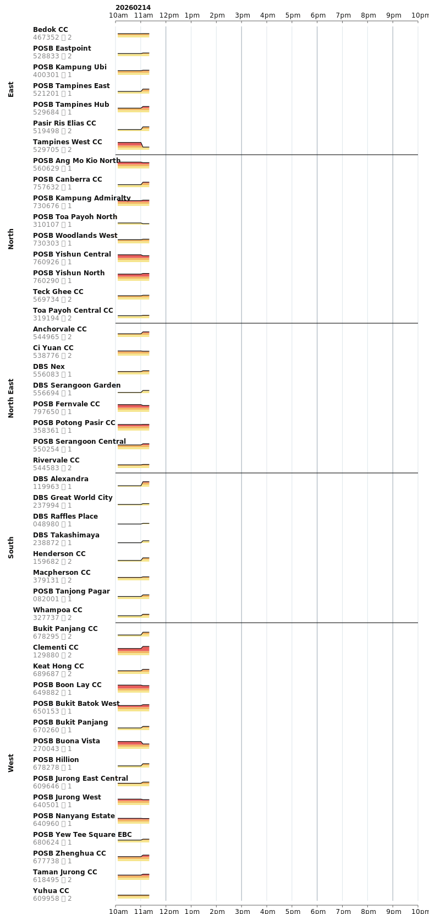

<details>
<summary>Older days</summary>

### 2026-02-13
- Snapshots: 106
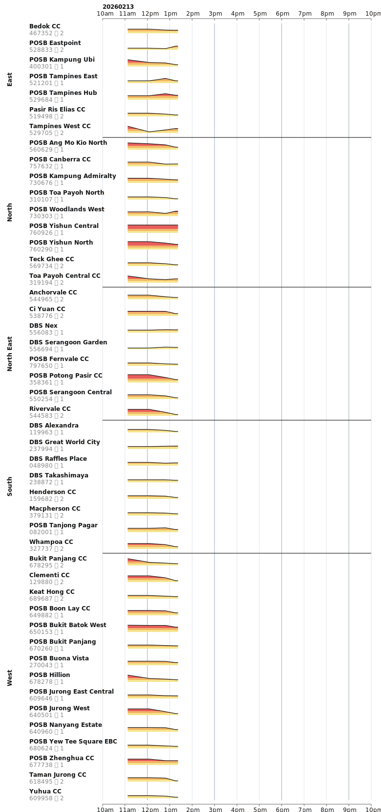

### 2026-02-12
- Snapshots: 51
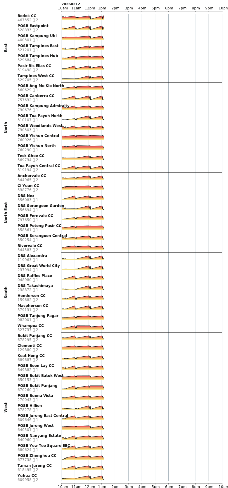

### 2026-02-11
- Snapshots: 70
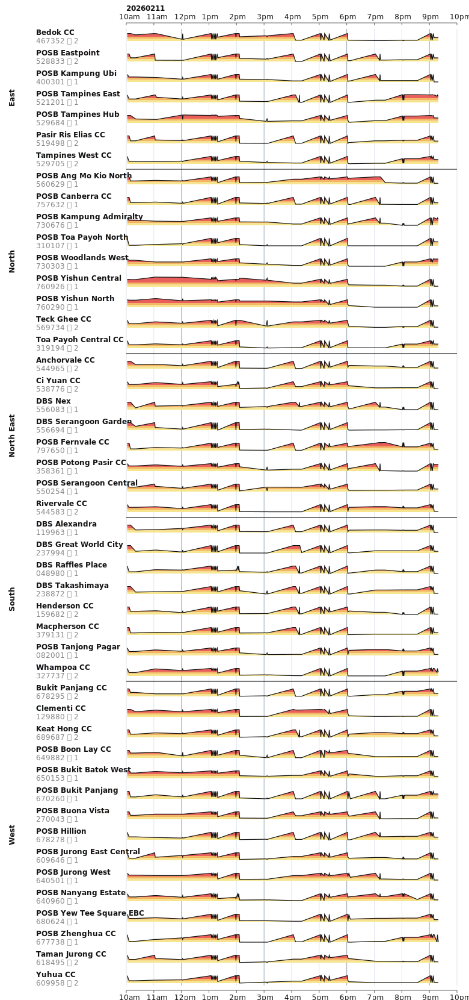

### 2026-02-10
- Snapshots: 61
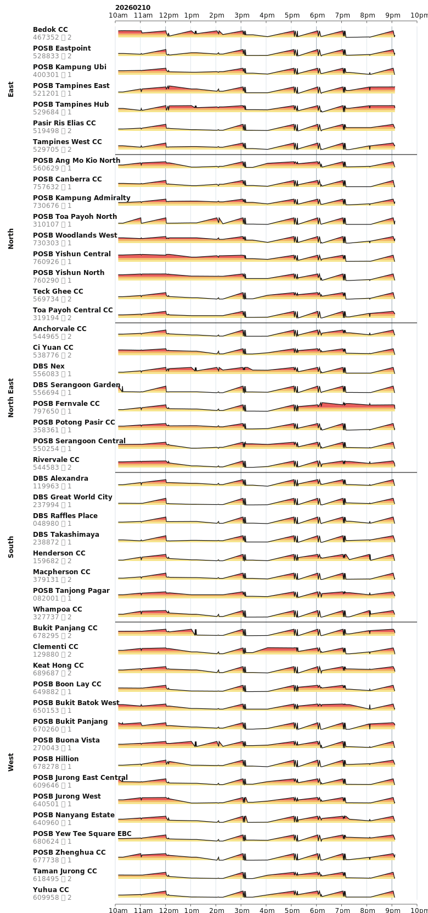

### 2026-02-09
- Snapshots: 45
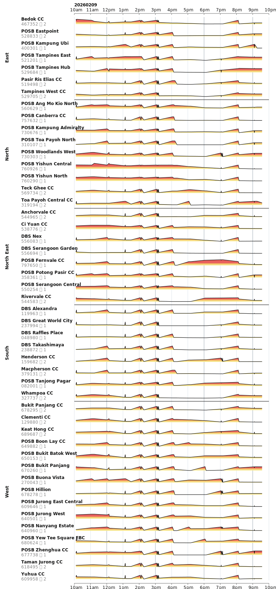

### 2026-02-08
- Snapshots: 60
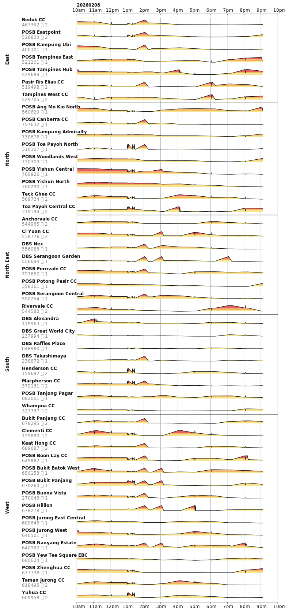

### 2026-02-07
- Snapshots: 45
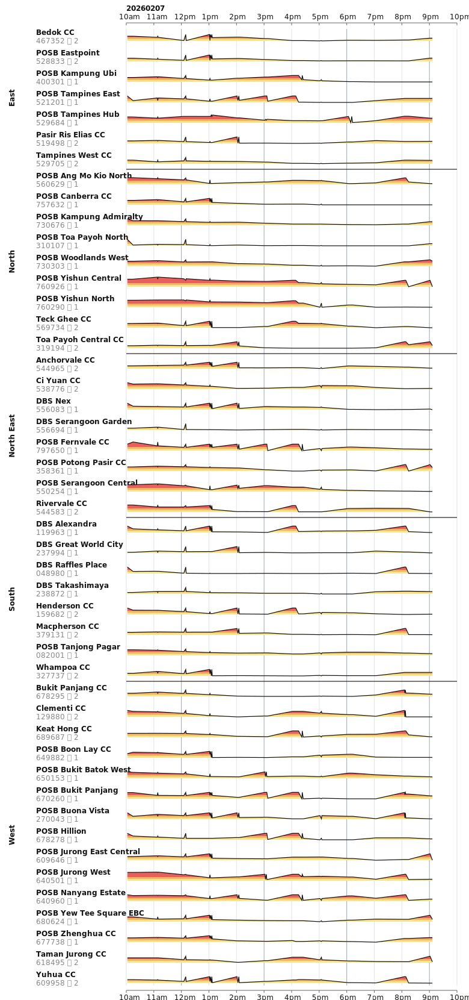

### 2026-02-06
- Snapshots: 46
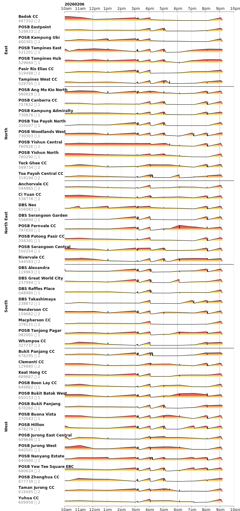

### 2026-02-05
- Snapshots: 72
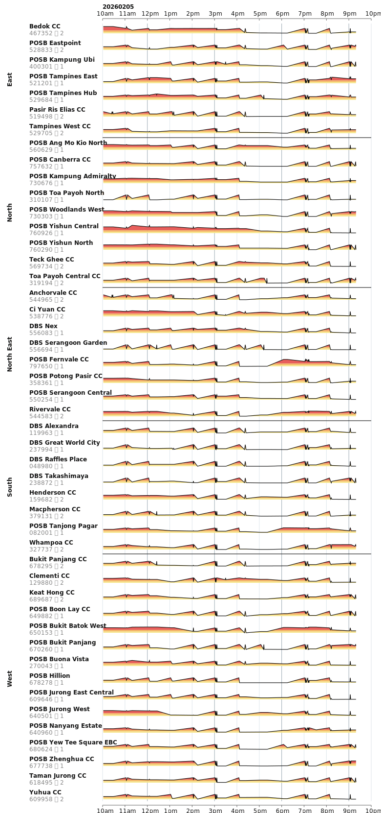

### 2026-02-04
- Snapshots: 64
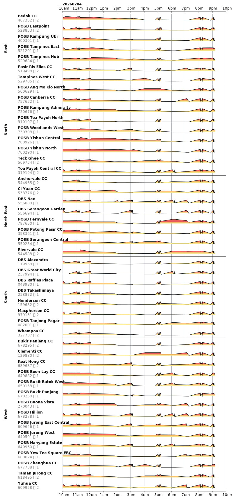

### 2026-02-03
- Snapshots: 41


</details>

<!-- CHARTS:END -->

## Credits

Data and source pages by DBS:
- [DBS Lunar New Year notes 2026](https://www.dbs.com.sg/personal/lny-notes-2026)
- [DBS pop-up ATM page](https://www.dbs.com/pop-up-atm/index.html)
